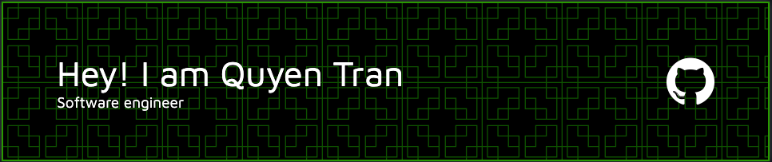

## Hey there 👋
---

I'm a fullstack developer driven by curiousity and loves picking up new skills and ideas.

---

<h3 align="left">Languages:</h3>

  
  
  
  
  

<h3 align="left">Tools and Frameworks:</h3>

  
  
  
  
  
  
  
  
  
  

---

  
  

<!-- 

  
  
  
  
  
  
  
  
  

### -->

<!-- 
&nbsp;
 -->

<!--
**qtran31/qtran31** is a ✨ _special_ ✨ repository because its `README.md` (this file) appears on your GitHub profile.

Here are some ideas to get you started:

- 🔭 I’m currently working on ...
- 🌱 I’m currently learning ...
- 👯 I’m looking to collaborate on ...
- 🤔 I’m looking for help with ...
- 💬 Ask me about ...
- 📫 How to reach me: ...
- 😄 Pronouns: ...
- ⚡ Fun fact: ...
-->
